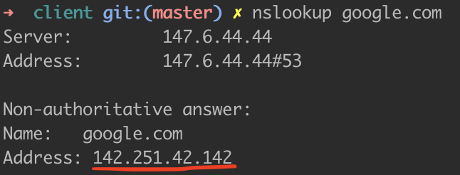
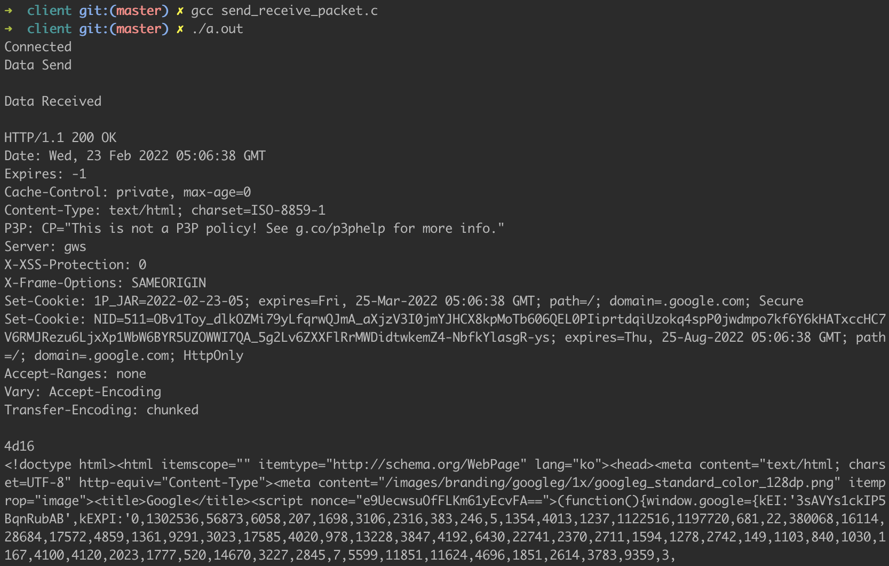

# Linux 네트워크 프로그래밍 - Client

1. **소켓 생성**
    
    ```c
    #include <stdio.h>
    #include <sys/socket.h>
    
    int main(int argc, char **argv)
    {
            //포트 번호를 임의지정하기 위해, 원하는 포트번호를 입력(argv)으로 받는다.
            int sockfd; //socket descriptor
            if(argc < 2) {
                    //포트번호가 입력으로 들어오지 않았을 때
                    printf("Usage: %s port\n", argv[0]);
                    return -1;
            }
            if((sockfd = socket(PF_INET, SOCK_STREAM, 0)) < 0) {
                    perror("Socket failed!");
                    return -1;
            }
    
            return 0;
    }
    ```
    
    ### int socket(int domain, int type, int protocol)
    
    소켓을 생성하는 함수로, 해당 소켓을 가리키는 socket descriptor를 반환한다.
    
    **param** : domain (통신할 영역)  
            - PF_INET / AF_INET : IPv4 주소 체계 사용  
            - PF_INET6 / AF_INET6 : IPv6 주소 체계 사용  
            - PF_LOCAL / AF_LOCAL : 로컬 통신을 위한 UNIX 프로토콜  
   		type (프로토콜 타입)  
   			- SOCK_STREAM : 서비스 타입 (TCP)  
   			- SOCK_DGRAM : 서비스 타입 (UDP)  
   			- SOCK_RAW : TCP/UDP 계층을 거치지 않고 바로 IP 계층 이용  
   		protocol (프로토콜 값)  
   			- IPPROTO_TCP : TCP일 때  
   			- IPPROTO_UDP : UDP일 때  
    **ret** : -1 (소켓 생성 실패)  
  		0 이상의 값(socket descriptor)  
    
2. **서버에 소켓 연결** 
    
    특정 포트 번호로 원격 서버에 연결하기 위해서는 연결할 **IP 주소**와 **포트 번호**가 필요하다.
    
    ```c
    #include <stdio.h>
    #include <sys/socket.h>
    #include <arpa/inet.h>
    
    int main(int argc, char **argv)
    {
            int socket_desc; //연결할 소켓 
            struct sockaddr_in server; // 서버
    
            //1. 소켓 생성
            socket_desc = socket(AF_INET, SOCK_STREAM, 0);
            if(socket_desc == -1) {
                    printf("Could not create socket.\n");
            }
    
    				//inet_addr 함수는 IP 주소를 long 타입으로 변환시켜준다.(s_addr 형식에 맞춤)
            server.sin_addr.s_addr = inet_addr("142.251.42.142"); //google.com IP
            server.sin_family = AF_INET;
            server.sin_port = htons(80);
    
            //2. 서버에 연결
            if(connect(socket_desc, (struct sockaddr *)&server, sizeof(server)) < 0) {
                    puts("connect error");
                    return 1;
            }
    
            puts("Connected");
            return 0;
    }
    ```
    
    위 코드에서 **sockaddr_in**과 관련 있는 <sys/socket.h>, <netinet/in.h> 내 정의되어있는 주요 구조체는 아래와 같다.
    
    ```c
    struct sockaddr_in {
     //인터넷 전용 소켓 주소 구조체
     short           sin_family;     // 소켓 주소 체계(AF_INET, AF_INET6, ...)
     unsigned short  sin_port;       // 포트번호 (ex. htons(3490))
     struct in_addr  sin_addr;       // IP 주소
     char            sin_zero[8];
    };
    
    struct in_addr {
     unsigned long   s_addr;
    };
    
    struct sockaddr {
     unsigned short  sa_family;      // address family, AF_XXX
     char            sa_data[14];    // 프로토콜 주소(14바이트)
    };
    ```
    
    클라이언트는 연결할 인터넷 서비스 포트 번호만 알면 되기 때문에 bind 함수가 따로 필요하지 않다. 
    
    ### int **connect(int sockfd, const struct sockaddr *serv_addr, socklen_t addrlen)**
    
    클라이언트가 서버에 연결 요청을 할 때 사용되는 함수이다. connect() 함수가 리턴되는 시점은, 연결 요청이 서버에 의해 수락되거나, 오류가 발생해서 연결 요청이 중단되는 경우이다. 만약 연결 요청이 바로 이루어지지 않고 서버의 대기 큐에서 대기하고 있는 상태라면 connect 함수를 리턴되지 않고, 블로킹 상태에 있게 된다.
    
    **param** : sockfd(클라이언트 소켓의 socket descriptor)  
    		serv_addr (서버의 주소 정보가 담긴 sockaddr 구조체 변수의 포인터)  
    		addrlen (serv_addr가 가리키는 sockaddr 구조체 변수의 크기)  
    **ret** : -1 (실패)  
    		0 (성공)  
    
3. **소켓을 통해 데이터 전송**
    
    send 함수를 통해 데이터를 전송하는데, 소켓 identifier, 보낼 데이터 및 크기가 필요하다. 
    
    ```c
    //3. 데이터 전송
    message = "GET / HTTP/1.1\r\n\r\n"; //웹사이트의 메인 페이지를 가져오는 http 명령
    if(send(socket_desc, message, strlen(message), 0) < 0) {
    	puts("Send failed");
      return 1;
    }
    puts("Data Send\n");
    ```
    
    ### int send(int s, const void *msg, size_t len, int flags)
    
    연결된 서버나 클라이언트로 데이터를 전송하는 함수이다.
    
    **param** : s(클라이언트 소켓의 socket descriptor)  
    		msg (전송할 데이터)  
    		len (데이터의 바이트 단위 길이)  
    		flags (옵션을 주기 위한 플래그, 따로 옵션을 지정하지 않으려면 0 입력)  
    			- MSG_DONTWAIT : 전송이 block되면 EAGIN, EWOULDBLOCK 오류로   
    					바로 return한다.  
    			- MSG_NOSIGNAL : 상대방과 연결이 끊겼을 때, SIGPIPE 시그널을 받지 않도록 한다.   
    			- MSG_WAITALL : 요청한 데이터의 크기가 모두 차야 함수를 반환한다.   
    			- MSG_MORE : 더 전송할 데이터가 있다.  
    **ret** : -1 (실패)  
    		-1 이외 (실제 전송한 바이트 수)  
    
4. **소켓에서 데이터 수신**
    
    recv 함수를 통해 소켓에서 데이터를 수신한다. 
    
    ```c
    //4. 서버로부터 응답 수신
    if(recv(socket_desc, server_reply, 2000, 0) < 0) {
    	puts("Receive failed");
      return 1;
    }
    puts("Data Received\n");
    puts(server_reply);
    ```
    
    ### **int** recv(**int** sockfd, **void** *buff, size_t len, **int** flags)
    
    연결된 소켓으로부터 데이터를 수신하는 함수이다.
    
    **param** : sockfd(클라이언트 소켓의 socket descriptor)  
    		buff(수신한 메시지를 저장할 버퍼 포인터)  
    		len (버퍼의 바이트 단위 길이)  
    		flags (옵션을 주기 위한 플래그, 따로 옵션을 지정하지 않으려면 0 입력)  
    			- MSG_DONTWAIT : 전송이 block되면 EAGIN, EWOULDBLOCK 오류로   
   					 바로 return한다.  
   			 - MSG_NOSIGNAL : 상대방과 연결이 끊겼을 때, SIGPIPE 시그널을 받지 않도록 한다.   
   			 - MSG_WAITALL : 요청한 데이터의 크기가 모두 차야 함수를 반환한다.   
   			 - MSG_MORE : 더 전송할 데이터가 있다.  
    **ret** : -1 (실패)  
    		-1 이외 (실제 수신한 바이트 수)  
    
5. [google.com](http://google.com) IP 주소 찾기 & 코드 실행
    
    원하는 Domain Name에 해당하는 IP 주소를 찾는 방법은 크게 두 가지가 있다.
    
    1. 터미널에서 nslookup 명령어를 사용한다.
        
        ```c
        nslookup google.com
        ```
        
        
        
    2. IP 주소를 가져오는 C 코드를 작성한다. 코드 및 실행 결과는 아래와 같다.
        
        ```c
        #include <stdio.h>
        #include <string.h>
        #include <sys/socket.h>
        #include <netdb.h>
        #include <arpa/inet.h>
        
        int main(int argc, char *argv[])
        {
                char *hostname = "www.google.com";
                char ip[100];
                struct hostent *he;
                struct in_addr **addr_list;
                int i;
        
                if((he = gethostbyname(hostname)) == NULL) {
                        //gethostbyname 함수 실패
                        herror("gethostbyname");
                        return 1;
                }
        
                //h_addr_list가 긴 형식의 IP 주소를 가지고 있기 때문에 in_addr에 h_addr_list를 캐스트한다.
                addr_list = (struct in_addr **)he->h_addr_list;
        
                for(i=0; addr_list[i] != NULL; i++) {
                        //첫 번째 값 반환
                        strcpy(ip, inet_ntoa(*addr_list[i]));
                }
        
                printf("%s -> %s", hostname, ip);
                return 0;
        }
        ```
        
        
        
    
    해당 IP 주소를 inet_addr 함수의 파라미터로 입력한다.   
    
    완성된 코드 및 실행 결과는 아래와 같다.
    
    ```c
    //소켓을 서버에 연결하고 데이터를 전송한다.
    #include <stdio.h>
    #include <string.h>
    #include <sys/socket.h>
    #include <arpa/inet.h>
    
    int main(int argc, char **argv)
    {
            int socket_desc;
            struct sockaddr_in server;
            char *message, server_reply[2000];
    
            //소켓 생성
            socket_desc = socket(AF_INET, SOCK_STREAM, 0);
            if(socket_desc == -1) {
                    printf("Could not create socket.\n");
            }
    
            server.sin_addr.s_addr = inet_addr("142.251.42.142"); //google.com IP
            server.sin_family = AF_INET;
            server.sin_port = htons(80);
    
            //서버에 연결
            if(connect(socket_desc, (struct sockaddr *)&server, sizeof(server)) < 0) {
                    puts("connect error");
                    return 1;
            }
    
            puts("Connected");
    
            //데이터 전송
            message = "GET / HTTP/1.1\r\n\r\n"; //웹사이트의 메인 페이지를 가져오는 http 명령
            if(send(socket_desc, message, strlen(message), 0) < 0) {
                    puts("Send failed");
                    return 1;
            }
            puts("Data Send\n");
    
            //서버로부터 응답 수신
            if(recv(socket_desc, server_reply, 2000, 0) < 0) {
                    puts("Receive failed");
    								return 1;
            }
            puts("Data Received\n");
            puts(server_reply);
    
            return 0;
    }
    ```
    
    
    
    응답으로 받은 데이터는 HTML 형식이다.
