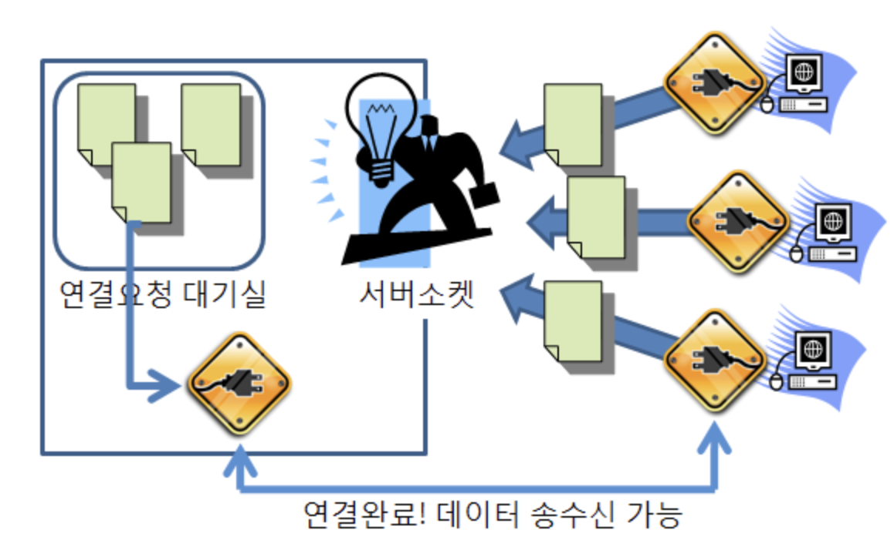
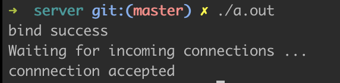

# Linux 네트워크 프로그래밍 - Server

1. **소켓 생성**
    
    ```c
    #include <stdio.h>
    #include <sys/socket.h>
    #include <arpa/inet.h>
    
    int main(int argc, char **argv)
    {
            int socket_desc; //연결할 소켓 
            struct sockaddr_in server; // 서버
    
            //1. 소켓 생성
            socket_desc = socket(AF_INET, SOCK_STREAM, 0);
            if(socket_desc == -1) {
                    printf("Could not create socket.\n");
            }
    
    				//inet_addr 함수는 IP 주소를 long 타입으로 변환시켜준다.(s_addr 형식에 맞춤)
            server.sin_addr.s_addr = inet_addr("142.251.42.142"); //google.com IP
            server.sin_family = AF_INET;
            server.sin_port = htons(80);
    
            return 0;
    }
    ```
    
    ### int socket(int domain, int type, int protocol)
    
    소켓을 생성하는 함수로, 해당 소켓을 가리키는 socket descriptor를 반환한다.
    
    **param** : domain (통신할 영역)
                     - PF_INET / AF_INET : IPv4 주소 체계 사용
                     - PF_INET6 / AF_INET6 : IPv6 주소 체계 사용
                     - PF_LOCAL / AF_LOCAL : 로컬 통신을 위한 UNIX 프로토콜
                   type (프로토콜 타입)
                     - SOCK_STREAM : 서비스 타입 (TCP)
                     - SOCK_DGRAM : 서비스 타입 (UDP)
                     - SOCK_RAW : TCP/UDP 계층을 거치지 않고 바로 IP 계층 이용
                   protocol (프로토콜 값)
                     - IPPROTO_TCP : TCP일 때
                     - IPPROTO_UDP : UDP일 때
    **ret** : -1 (소켓 생성 실패)
            0 이상의 값(socket descriptor)
    
2. **소켓을 포트에 바인딩**
    
    ```c
    //2. 소켓을 포트에 바인딩
    if(bind(socket_desc,(struct sockaddr *)&server, sieof(server)) < 0) {
    	puts("bind fail");
      return 1;
    }
    puts("bind success");
    ```
    
    ### int b**ind(int sockfd, struct sockaddr *myaddr, socklen_t addrlen);**
    
    소켓에 IP 주소와 포트를 할당해주는 함수
    
    **param** : sockfd(서버 소켓의 socket descriptor)
                   myaddr(주소 정보) 
                    - 통신 방법이 AF_INET일 때, struct sockaddr_in을 사용 
                    - 통신 방법이 AF_UNIX일 때, struct sockadd를 사용
                   addrlen(구조체의 크기)
    **ret** : -1 (실패)
             0 (성공)
    
3. **소켓에서 들어오는 연결 수신 대기**
    
    listen 함수를 통해 소켓을 수신 대기 상태로 전환시킬 수 있다.
    
    ```c
    //3. 연결 수신 대기
    listen(socket_desc, 3);
    ```
    
    ### int listen(int sockfd, int backlog)  
    
    서버 소켓을 CLOSE 상태에서 LISTEN 상태로 변경하고, 연결을 요청한 클라이언트 소켓을 SYN_RCVD   상태에서 3-way-handshaking을 완료하고 ESTABLISHED 상태로 전환한다.  
    
    **param** : sockfd(서버 소켓의 socket descriptor)  
                   backlog(연결요청 대기 큐의 크기)   
    **ret** : -1 (실패)  
             0 (성공)  
    
4. **연결 수락 및 수신**
    
    클라이언트와 연결을 성공하면, 서버는 accept 함수를 호출하고, 클라이언트와 통신을 하기 위한 소켓을 반환한다. 따라서 Listen을 위한 소켓과, 클라이언트 연결을 받기 위한 Accept를 위한 소켓, 총 **2개의 소켓이 필요**하다.
    
    Accept 소켓은 클라이언트와 직접 데이터를 주고 받기 위한 연결고리로 사용되고, Listen 소켓은 계속 다음 연결을 받기 위한 용도로 사용된다.
    
    ```c
    //4. 연결 수락 및 수신
    puts("Waiting for incoming connections ... ");
    c = sieof(struct sockaddr_in);
    new_socket = accept(socket_desc, (struct sockaddr *)&client, (socklen_t*)&c);
    
    if(new_socket < 0) {
    	perror("accept failed");
      return 1;
    }
    
    puts("connnection accepted");
    ```
    
    
    
    ### int accept(int sockfd, struct sockaddr *addr, socklen_t *addrlen)  
    
    연결 요청 대기 큐에서 제일 처음 들어온 연결 요청을 가져와서 새로운 연결된 소켓을 만든다. 그리고 이   소켓을 가리키는 socket descriptor를 할당하고 리턴한다.  
    
    **param** : sockfd(서버 소켓의 socket descriptor)  
                   addr(연결 요청을 한 클라이언트의 주소 정보가 저장될 구조체 대한 포인터)   
                   addrlen(*addr 포인터가 가리키는 구조체의 바이트 크기)   
    **ret** : -1 (실패)  
             -1 이외 (새로운 socket descriptor)  
    
5. **코드 실행**
    
    완성된 코드 및 실행 결과는 다음과 같다.
    
    ```c
    //서버의 특정 IP, 특정 포트로 들어오는 연결을 수락하고 데이터를 수신한다.
    #include <stdio.h>
    #include <sys/socket.h>
    #include <arpa/inet.h>
    
    int main(int argc, char **argv)
    {
            int socket_desc, new_socket, c;
            struct sockaddr_in server, client;
    
            //소켓 생성
            socket_desc = socket(AF_INET, SOCK_STREAM, 0);
            if(socket_desc == -1) {
                    printf("Could not create socket.\n");
            }
    
            //server.sin_addr.s_addr = inet_addr("142.251.42.142"); //google.com IP
            server.sin_addr.s_addr = INADDR_ANY;
            server.sin_family = AF_INET;
            server.sin_port = htons(80); //80 포트에서 들어오는 연결을 확인할 것이다.
    
            //소켓을 특정 IP주소와 특정 포트번호에 묶는다.(bind)
            //이렇게 하면 이 포트 번호로 향하는 모든 수신 데이터가 이 애플리케이션에서 수신된다.
            if(bind(socket_desc,(struct sockaddr *)&server, sizeof(server)) < 0) {
                    puts("bind fail");
                    return 1;
            }
            puts("bind success");
    
            //소켓에서 들어오는 연결 수신 대기
            listen(socket_desc, 3); //연결요청 대기 큐의 크기 : 3
    
            //연결 수락 및 수신
            puts("Waiting for incoming connections ... ");
            c = sizeof(struct sockaddr_in);
            //accept함수에서 반환된 new_socket 소켓은 문지기 역할을 하는데,
            //연결 요청을 한 클라이언트 소켓과 자동으로 연결된다.
            new_socket = accept(socket_desc, (struct sockaddr *)&client, (socklen_t*)&c);
    
            if(new_socket < 0) {
                    perror("accept failed");
                    return 1;
            }
    				puts("connnection accepted");
    
            return 0;
    }
    ```
    
    
